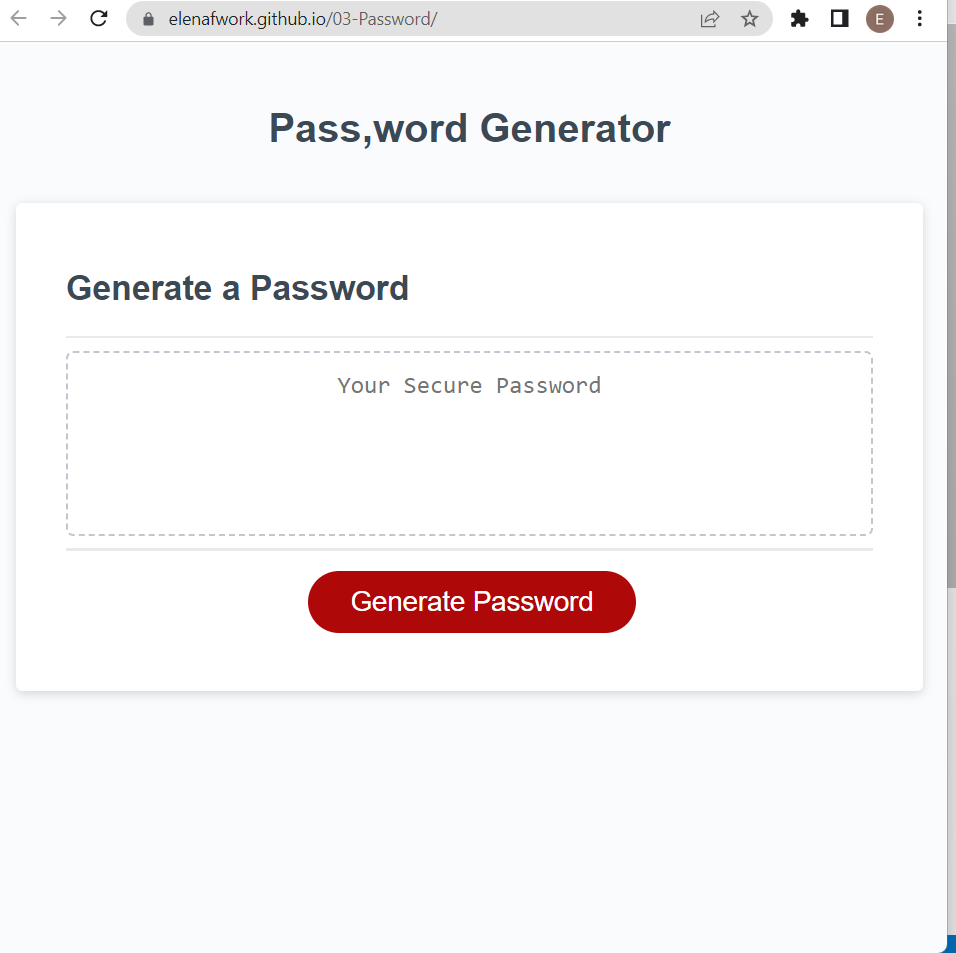
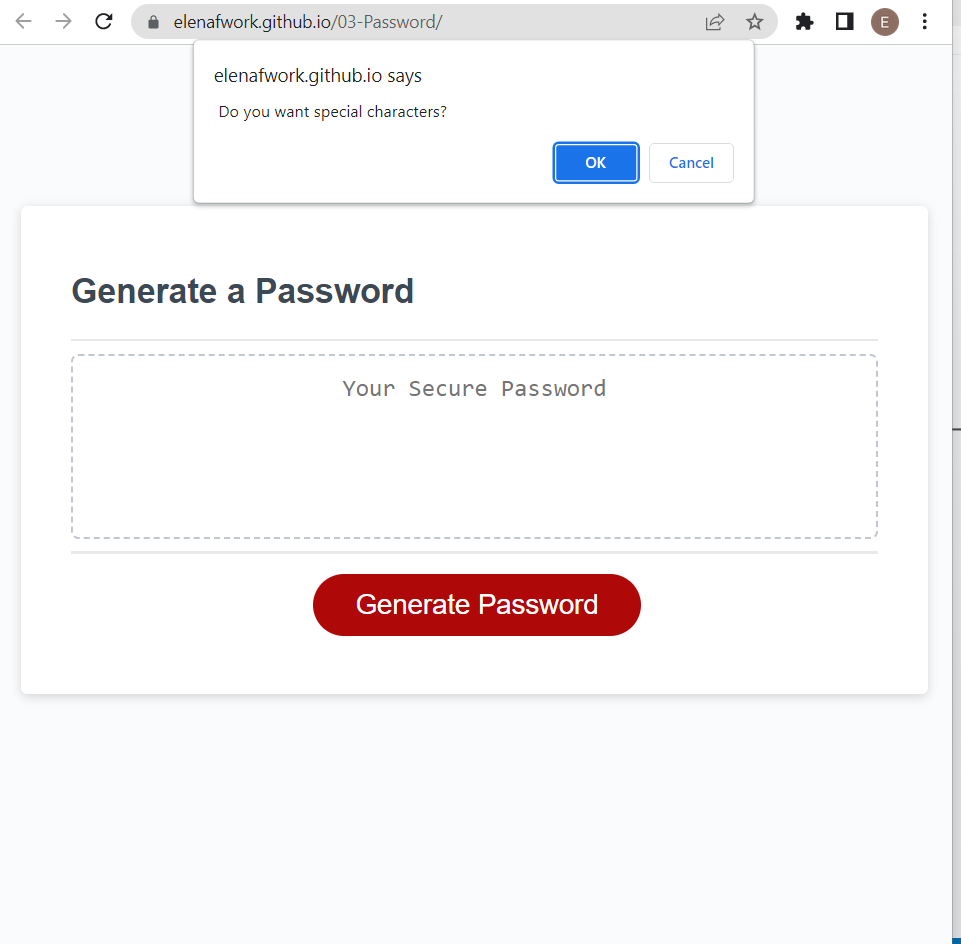
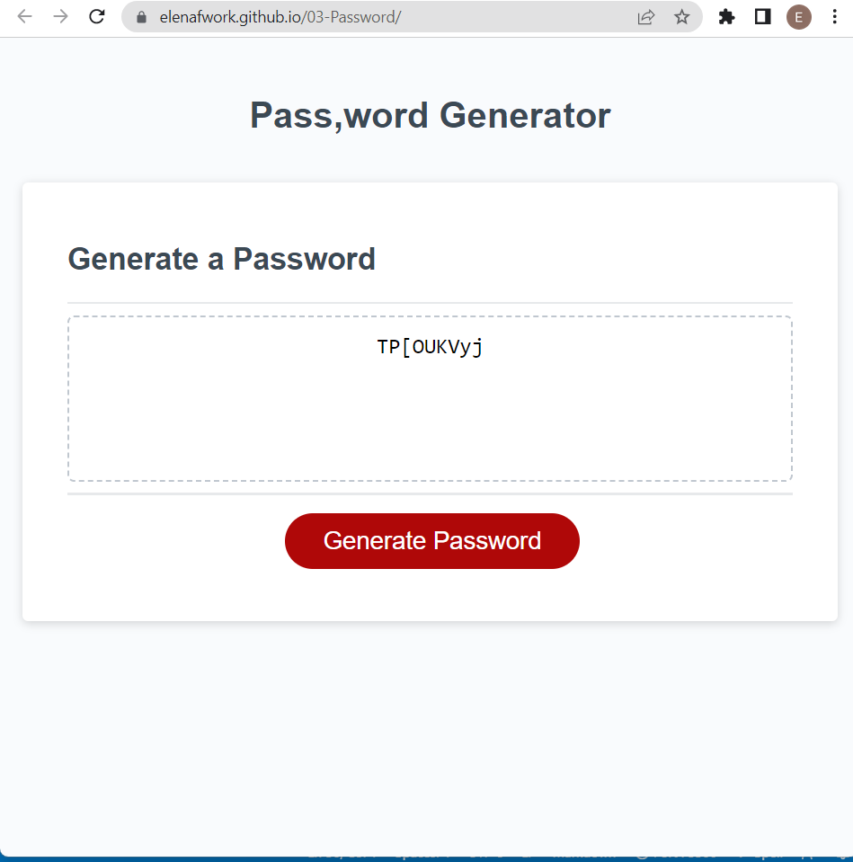

# Password Generator Webpage 

## Description

This project was created to generate password according to certain criteria:

 - User needs a new, secure password.
 - After clicking the button  "Generate  Password" the User is presented with a series of prompts for password criteria.
 - When User prompted for password criteria he/she can select which criteria to include in the password.
 - When prompted for the length of the password User can choose a length of at least 8 characters and no more than 128 characters.
 - When asked for character types to include in the password the User confirms whether or not to include lowercase, uppercase, numeric, and/or special characters.
 - When User answer each prompt his/her input should be validated and at least one character type should be selected.
 - When all prompts are answered then a password is generated that matches the selected criteria.
 - When the password is generated then the password is either displayed in an alert or written to the page.

## Usage

After clicking the link below you will be able to see deployed application.

https://elenafwork.github.io/03-Password/

The webpage looks like this: 

  

After clicking the button "Generate password" you will see a series of prompts for password criteria: 

  

The final result - password - is written in  above the button and can be copied and paste.

  

## Credits

Special credits to "Dev By RayRay"  for information about picking random letter from alphabet array.
https://byrayray.dev/posts/2022-01-28_how-to-generate-an-alphabet-javascript-array-eae6940ea646

## License

Please , refer to the repo license.

